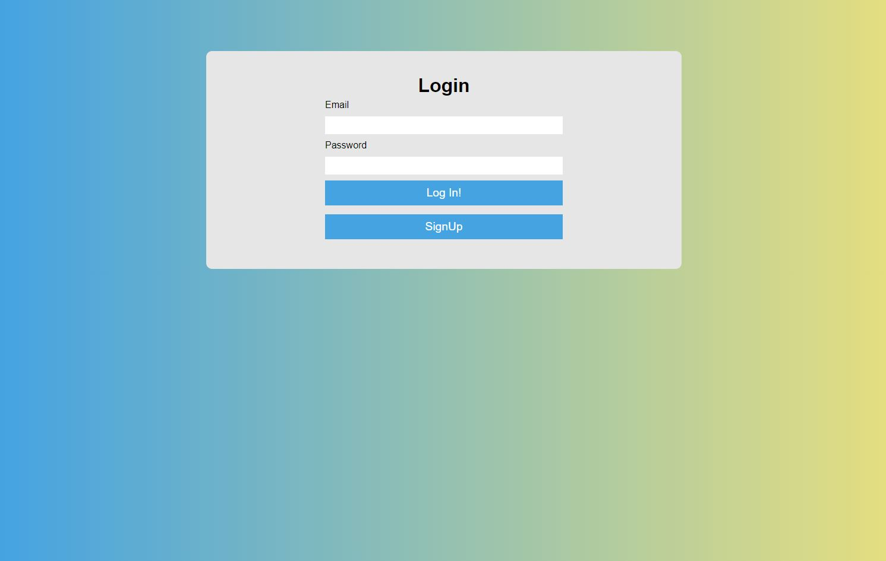
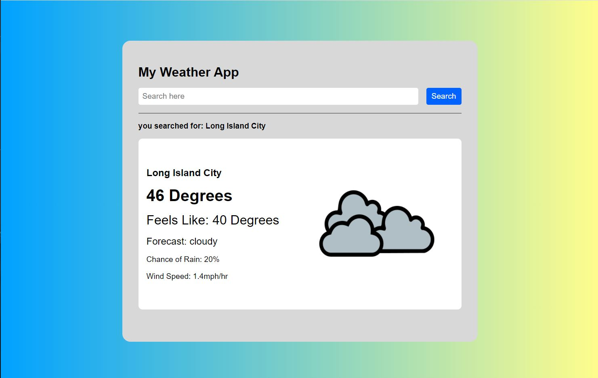

# Weather App Intro

## Part 1
### Goals
- Basic HTML 
- CSS practice (use flexbox if you can)
- Image Imports
- Responsive Design 

- Part 1 will be used to give you some practice seeing a template or base image and creating it on your own. Below is an example or template that you can follow but feel free to make any designs you want. 
- This is mainly a frontend practice so I'll be looking at how you organized your html and more importantly how you went about styling the page with css. I'd like this page to be responsive so look into media queries if you don't have them already 

## Topics to research:
- Media Queries 
- Responsive Design 
- Mobile First Design (less important) 

Have a look at these screenshots. You can either copy the design as best you can but I'd prefer if you made your own design or include your own interpretation if this design is too basic 

## Part 2 (Only after I've reviewed Part 1)
### Topics:
- Integration with a weather API
- Dom Manipulation

### Goals
- Use a weather API to dynamically search for data and get the actual weather of a location
- Use Dom Manipulation to replace the hardcoded template from part 1
- Use Dom Manipulation to add some creative styling based on values from the API 
- we'll talk about how to do this via javascript in your main.js